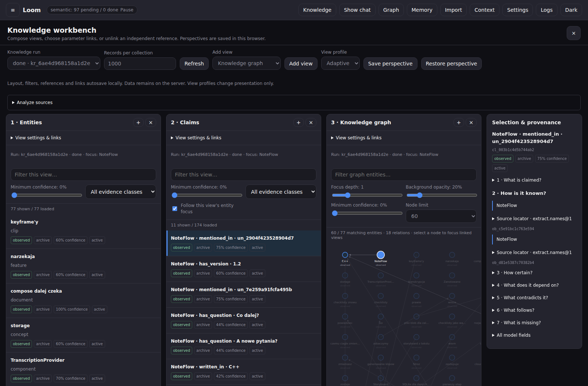

# ChatADHD / Loom

A local-first conversation workbench with a reusable C++20 kernel. ChatADHD
explores branching conversations and inspectable memory; Loom provides the
storage, import, graph, context and resumable analysis machinery behind it.

**Development preview for developers and testers.** The native kernel, CLI,
HTTP server and React workbench run today. The Python/Kivy prototype is retained;
Android has a JNI bridge but still needs device validation. This is not yet a
packaged consumer release.



*Synthetic offline demonstration against the native server, with LLM analysis
disabled. It shows the inspectable workflow, not general extraction accuracy.*

## What is distinctive

- **Preserve the source.** Imports retain raw source material and provenance;
  editing a conversation preserves earlier versions.
- **Inspect the context.** Memory, graph records, claims, supporting sources and
  context-selection reasons are exposed through the workbench and APIs.
- **Reuse one kernel.** A C ABI connects the native library to clients without
  requiring the storage and analysis logic to be reimplemented.
- **Keep code and user data separate.** Application upgrades replace code;
  persistent stores, attachments and secrets have their own data directory.

## Architecture and current scope

| Component | Role and current boundary |
|---|---|
| [`loom/`](loom/README.md) | C++20 library, C ABI, SQLite storage, import/provenance, tasks, graph and context pipelines |
| [`loom/cli/`](loom/cli/) | CLI for chat, import, search, archives, knowledge runs and artifact inspection |
| [`loom/server/`](loom/server/) + [`loom/web/`](loom/web/README.md) | REST/SSE facade and React/TypeScript workbench; browser/native integration tested |
| [`loom/android/`](loom/android/README.md) | JNI/WebView shell; host-side bridge tests, device testing outstanding |
| `core/`, `engine/`, `gui/`, `main.py` | Retained Python/Kivy prototype and compatibility regression sentinels |

The workbench includes independent and linked graph views, source inspection,
browser-local saved perspectives and explicit context preview. Native
CandidateGraph and the Python GraphPacket research representation remain
distinct. [Explicit GraphPacket persistence](docs/NATIVE_GRAPH_PACKET_STORE.md)
now writes selected entities, claims and observations to native KnowledgeStore,
with atomic acceptance, immutable receipts and checked readback/replay.
Full GraphPacket history validation remains in Python.

[Application interface profiles](docs/APPLICATION_PROFILES.md) add versioned
JSON views and declared workflows over registered Loom operations. Multiple
views can share a conversation while keeping model/context controls independent.
Bundled ChatGPT/Claude/Gemini examples are inspired prototypes with unverified
original versions; they do not reproduce the services' private backends.

## Build and open a synthetic demo

Requirements: CMake 3.25+, Ninja, a C++20 compiler, Python 3.11+ and Node.js
with npm. The commands below run from the repository root and use bundled
SQLite. See [Loom's build guide](loom/README.md#build) for other presets.

```bash
python3 -m pip install requests cryptography -r loom/tools/contracts/requirements.txt
cmake --preset dev -S loom -DLOOM_USE_SYSTEM_SQLITE=OFF -DLOOM_BUILD_SERVER=ON
cmake --build loom/build/dev -j 4
ctest --test-dir loom/build/dev --output-on-failure -j 4
npm --prefix loom/web ci
npm --prefix loom/web run build

DEMO_DATA="$(mktemp -d)"
./loom/build/dev/cli/loom --data-dir "$DEMO_DATA" knowledge run \
  --source loom/tests/fixtures/eval/synthetic_dev/chatgpt_export.zip \
  --source loom/tests/fixtures/eval/synthetic_dev/claude_export.zip \
  --no-priors --llm off
./loom/build/dev/server/loom-server --host 127.0.0.1 --port 8787 \
  --data-dir "$DEMO_DATA" --static-dir loom/web/dist
```

Open [http://127.0.0.1:8787](http://127.0.0.1:8787) and select **Knowledge**.
Explore the fictional source corpus, graph and claims, then build a context
preview. This demo needs no API key. Live chat requires configuring a provider
and key in Settings. The [demo guide](docs/DEMO.md) gives a short walkthrough
and describes what each step establishes.

## Evidence and limits

The [2026-10-03 verification report](docs/verification/current-2026-10-03/RESULTS.md)
records **108/108 CTest suite entries** and **13/13 native GraphPacket store
regressions**. The [previous verification](docs/verification/current-2026-10-02/RESULTS.md)
also records a successful web production build and browser tests against the
real native server; web source is unchanged. Chat tests use a local fake
provider. These are engineering checks on the recorded source snapshots;
they do not establish general extraction accuracy, recipe efficacy or model
quality. Android packaging, real devices and real external providers were not
part of that verification.

[Current state](docs/STATE.md), [engineering gaps](docs/LIMITS_AND_WIRING_2026-10-01.md)
and the [Claude handoff](docs/HANDOFF_2026-10-02_TO_CLAUDE.md) describe what remains.
[Documentation](docs/README.md) keeps current reports at the front; the
[archive index](docs/archive/README.md) explains how to reconstruct historical
branches and experiments.

## Data and licensing

Use a separate data directory for demonstrations. Optional local encryption
does not prevent a configured remote provider from receiving the plaintext
sent to it. API secrets belong in the data store, outside the repository.

**Source-available:** noncommercial use is licensed under
[PolyForm Noncommercial 1.0.0](LICENSE). Commercial use requires a separate
written license; see [commercial licensing](COMMERCIAL_LICENSE.md).
